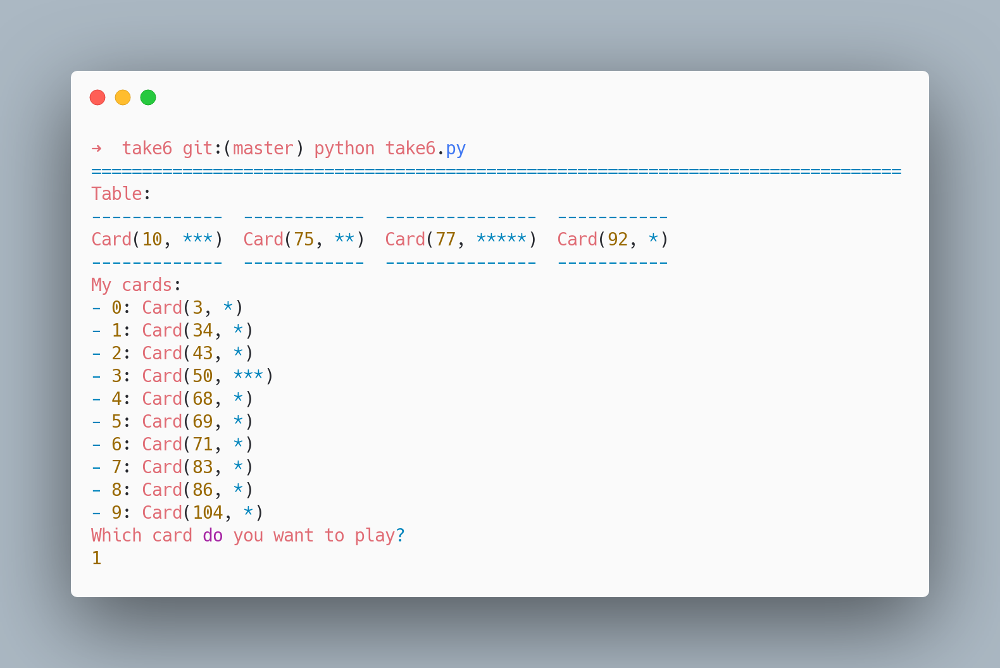

# Take 6 / 6 Nimmt

A simple python implementation of [Take 6! / 6Nimmt](https://en.wikipedia.org/wiki/6_Nimmt!)



## Install

You need python > 3.x.

Install requirements with

```bash
pip install fire tabulate dataclasses
```

## Play

To launch a game against the computer

```bash
python take6.py --name Me --num_players 3
```

At each round, you need to enter the card index you want to play.

For example, writing `5` and then hitting enter will play `Card(79, *)`.

```bash
Table:
-----------  -----------  -----------  ------------
Card(14, *)  Card(17, *)  Card(63, *)  Card(101, *)
Card(52, *)  Card(19, *)  Card(76, *)
Card(54, *)  Card(24, *)
Card(61, *)  Card(27, *)
-----------  -----------  -----------  ------------
My cards:
- 0: Card(20, ***)
- 1: Card(23, *)
- 2: Card(45, **)
- 3: Card(53, *)
- 4: Card(67, *)
- 5: Card(79, *)
- 6: Card(84, *)
Which card do you want to play?
5
```

Contrary to the official rules, you cannot chose which stack your cards will go on the table if it cannot fit. The game will insert your card in the stack with the lowest sum of points.
